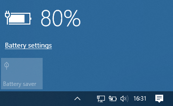
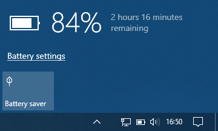

# PicoHIDPowerDevice
A HID UPS device controller based around a Raspberry Pi RP2040, intended to be the logic handler for a 12V DC-DC UPS to back up and gracefully shut down a NAS box in the event of extended power cuts.

I have taken inspiration from the work at: https://github.com/abratchik/HIDPowerDevice and rewritten the logic to Micropython. These files allow the use of a RP2040 type board (with USB capabilities) to act as a HID compliant UPS. The library is useful if you want to build a smart UPS or other power device, which can report its state to the host computer.

For more information about USB HID specs please read https://www.usb.org/sites/default/files/pdcv11.pdf

## Setup & Usage
These files represent the logic management, for a full implmentation you will need to design the battery management components, also an analogue input of your backup battery level and a mains power detection input, both read by the Pico. 

This demo code simply loops; after about 5 minutes it will simulate a power fail - your computer should indicate that it is running on battery. During the next few minutes the Pico will report a declining battery level and runtime. After about 5 minutes in this state the simulated power will return and the simulated battery should show a charging status.  

> Be aware that depending on your computer configuration this demo has the potential to trigger your computer to shut down because of a pwoer fail state and low battery condition

* copy the Micropython HID library files USB/device/hid.py and core.py onto the Pico (https://github.com/micropython/micropython-lib/tree/master/micropython/usb)
* copy the files from this repository onto the Pico
* edit ups_demo.py with values you wish 
* plug the Pico into a Windows/macOS/Linux computer (or NAS box - only tested on Synology) 
* after 5 seconds the device will appear as a USB connected UPS and the demo will start to run

simulated charging battery on AC: 
  

simulated power fail: 
  

if using on a Linux device, if the Pico is not seen as a UPS, then in `ups_demo.py` you may need to update the [line with the vendorID](https://github.com/jef41/PicoHIDPowerDevice/blob/main/ups_demo.py?plain=1#L63) of the device to that of a known UPS vendor, or alternatviely [see the advice for changing udev rules](https://github.com/abratchik/HIDPowerDevice?tab=readme-ov-file#additional-setup-step-on-linux-hosts) already worked out for that project.

